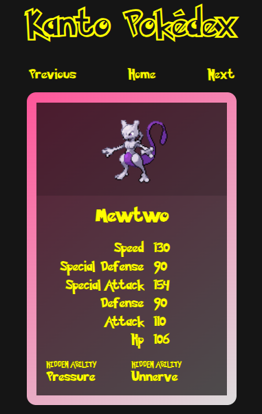

# Pokédex

## Table of Contents
- [About](#about)
- [Starting the app](#starting-the-app)
- [Component tests](#component-tests)
- [E2E tests](#e2e-tests)
- [ESLint](#eslint)
- [Docker](#docker)
- [Access](#access)


## About

This repository is used for the CI/CD module of the Full Stack Open course.

- [Live test⇗](https://kantopokedex.onrender.com) available on Render.

- Docker image available on Hub
  ```bash
  docker pull rafaeltorok/pokedex:latest
  ```

### Screenshots




## Starting the app

### Dev mode

Run the webpack dev server
```bash
npm install && npm run start
```

- Access the Web UI on http://localhost:8080

### Production mode

Build the project
```bash
npm install && npm run build
```

Start the production build
```bash
npm run start-prod
```

- Access the Web UI on http://localhost:5001

- Express server health check
  ```bash
  curl http://localhost:5001/health
  ```


## Component tests

```bash
npm run test
```


## E2E tests

- CLI mode
  ```bash
  npm run e2e
  ```

- UI mode (browser window)
  ```bash
  npm run e2e:ui
  ```

- Playwright report
  ```bash
  npm run e2e:report
  ```


## ESLint

Run ESLint
```bash
npm run eslint
```


## Docker

1. Build the image
    ```bash
    docker build -t kanto-pokedex .
    ```

2. Run the container
    ```bash
    docker run --name kanto-pokedex -p 5001:5001 kanto-pokedex
    ```

- Access the Web UI on http://localhost:5001

- Health checks on http://localhost:5001/health
