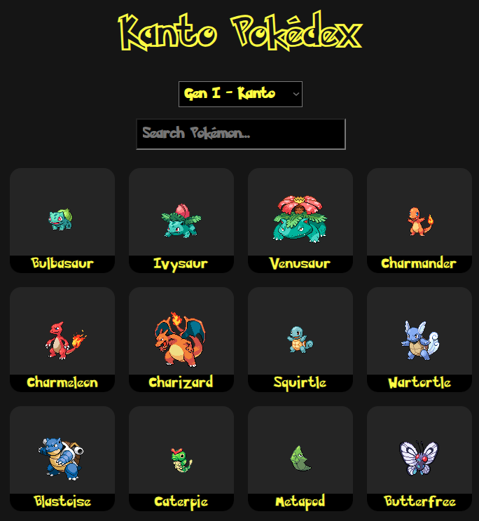
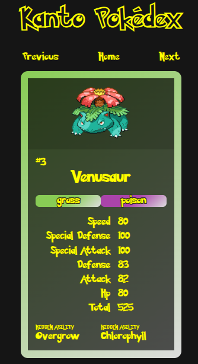
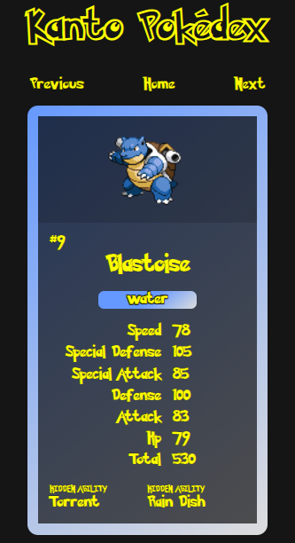

# Pokédex Catalog

## Table of Contents
- [About](#about)
- [Starting the app](#starting-the-app)
- [Component tests](#component-tests)
- [E2E tests](#e2e-tests)
- [ESLint](#eslint)
- [Docker](#docker)
- [Access](#access)


## About

Project part of the CI/CD module for the Full Stack Open course by MOOC Finland.

- [Live test⇗](https://pokedex-catalog.onrender.com) available on Render.

- Docker image available on Hub
  ```bash
  docker pull rafaeltorok/pokedex:latest
  ```

### Features

- Display a list of all Pokémons from the first four generations (Kanto, Johto, Hoenn and Sinnoh).

- Search by any Pokémon based on their names.

- Choose which generation you want to display the list for.

- See information for all of the base stats, plus the main ability and hidden ability for each Pokémon.

### Screenshots



<div style="display: flex;">
  
  
  
</div>


## Starting the app

### Dev mode

Run the webpack dev server
```bash
npm install && npm run start
```

- Access the Web UI on http://localhost:8080

### Production mode

Build the project
```bash
npm install && npm run build
```

Start the production build
```bash
npm run start-prod
```

- Access the Web UI on http://localhost:5001

- Express server health check
  ```bash
  curl http://localhost:5001/health
  ```


## Component tests

```bash
npm run test
```


## E2E tests

- CLI mode
  ```bash
  npm run e2e
  ```

- UI mode (browser window)
  ```bash
  npm run e2e:ui
  ```

- Playwright report
  ```bash
  npm run e2e:report
  ```


## ESLint

Run ESLint
```bash
npm run eslint
```


## Docker

1. Build the image
    ```bash
    docker build -t pokedex-catalog .
    ```

2. Run the container
    ```bash
    docker run --name pokedex-catalog -p 5001:5001 pokedex-catalog
    ```

- Access the Web UI on http://localhost:5001

- Health checks on http://localhost:5001/health
